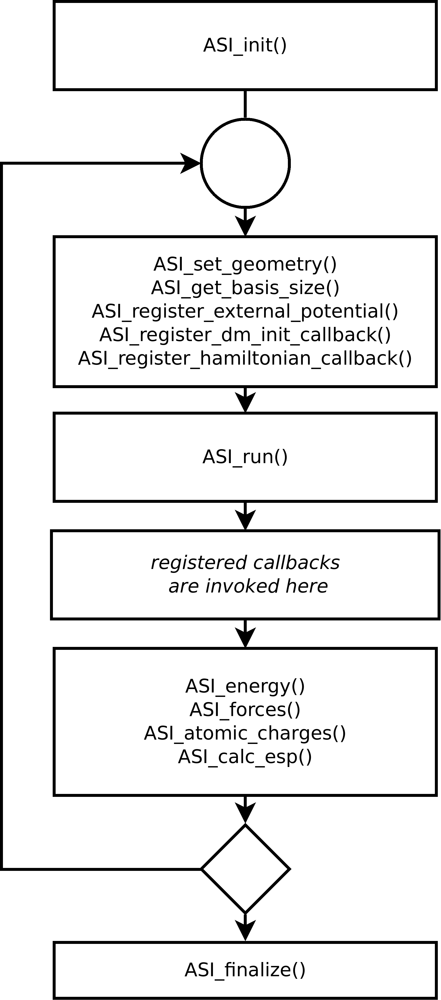

# Summary

The Atomic Simulation Interface (ASI) is a native C-style API for density functional theory (DFT) codes. ASI provides an efficient way to import and export large arrays that describe electronic structure (e.g. Hamiltonian, overlap, and density matrices) from DFT codes that are typycally monolithic. The ASI API is designed to be implemented and used with minimal performance penalty, avoiding, where possible, unnecessary data copying. It provides direct access to the internal data structures of a code, and reuses existing data distribution over MPI nodes.  The ASI API also defines a set of functions that support classical and hybrid QM/MM simulations: exporting potential energy, forces, atomic charges, and electrostatic potential at user defined points, as well as importing nuclear coordinates and arbitrary external electrostatic potentials. The ASI API is implemented in the DFTB+ and FHI-aims codes. A Python wrapper for easy access to ASI functions is also freely available (`asi4py`). We hope that the ASI API  will be widely adopted and used for development of universal and pluggable DFT codes without sacrificing efficiency for portability.


# Statement of need

Although numerous modern electronic structure codes have a common mathematical basis and often share core algorithm implementations (ESL [@ESL], ELSI [@Yu2018; @YU2020107459], libxc [@MARQUES20122272; @LEHTOLA20181]), a portable and efficient way to access resulting electronic structure variables from the user side remains elusive. For classical and hybrid QM/MM calculations, a similar issue is solved by the widely adopted i-PI interface [@kapil2019pi], ASE library [@Hjorth_Larsen_2017], and ChemShell environment [@ChemShell], however, for electronic structure data, such as wave functions, band structure, Hamiltonian or density matrices, there is no widely adopted solution, probably due to diversity of basis sets. Therefore, many well-developed codes for electronic structure analysis and integrating machine learning are hard to employ due to their explicit dependency on specific electronic structure calculation codes. Machine learning models can be trained disregarding details of a specific electronic structure code's basis sets, therefore even without a universal representation of electronic quantities, a convenient and efficient way to access detailed electronic structure description will benefit the efforts towards modularization of electronic structure software.

# State of the field

Demand to access electronic structure data is driven currently by the urge to apply recent machine learning advances in the quantum chemistry field. After numerous successful applications of machine learning for direct energy and forces prediction from atomic coordinates [@PhysRevX.8.041048; @SchNetPack; @PhysRevLett.114.096405], data-driven models that predict electronic structure beyond energies and forces are being addressed. Such data-driven models provide more interpretable outcomes, possess higher transferability, and can be used for prediction of a wider set of material's properties. For example, @CarleoTroyer have employed reinforcement-learning to compute ground state and unitary time evolution of a few prototypical systems, and @DFTB-DL have developed a deep learning model that predicts a Hamiltonian matrix for subsequent  SCC-DFTB calculations. The SchNOrb deep learning framework uses neural tensor network representation of wave-functions for Hamiltonian matrix prediction [@Schnorb].

Today, many electronic structure software packages use files to export or import information about electronic structure or potentials; this approach is implemented in ORCA [@Orca], Quantum Espresso [@QE2020], CP2K [@cp2k], FHI-aims [@FHIaims], DFTB+ [@DFTBp], etc. Although file-based data exchange has advantages, it unavoidably introduces performance penalties and often takes additional coding efforts for data parsing and formatting, as storage formats are rarely good for active calculations. Rare exceptions such as GPAW [@GPAW2005], Psi4 [@Psi4], DFTK.jl [@DFTKjcon] do provide Python or Julia API and thus siplify development of a new functionality for them.

We believe the field will benefit from implementation of a universal API for access to DFT-related quantities in popular quantum chemistry codes. Even without universal specifications of basis sets, an API for access to Hamiltonian, overlap, and density matrices would be helpful for the applications mentioned above. It will pave the way to implementation of new machine learning models and electronic structure analysis tools, and will accelerate their adoption.

# Functionality

The Atomic Simulation Interface (ASI) is a specification of pure C functions, designed to be implemented in existing quantum chemistry codes. The scope and capabilities of ASI mostly focus on efficient way to transfer electronic structure data. The complete ASI specification can be found on the project web page [pvst.gitlab.io/asi](https://pvst.gitlab.io/asi). The plain C API was chosen for simplicity of implementation in Fortran codes and for simplicity of invocation from other languages including Python and Julia. For the sake of convenience, a Python wrapper for ASI functions has been created: `asi4py` is available for installation via `pip` (package installer for Python). The `asi4py` wrapper was designed to be used with the ASE framework [@Hjorth_Larsen_2017] implementing the ASE's `Calculator` interface. Therefore, any DFT code that implements ASI API automatically gets an ASE calculator with efficient data transfer.

There  are four groups of key ASI functions that are briefly described in Table 1, united by their primary purpose: control flow, atomic information, electrostatic potential exchange, and transfer of large arrays describing electronic structure of the simulated system (currently routines for Hamiltonian, overlap and density matrices are included in the ASI specification). Table 1 lists only a subset of ASI functions, ommiting auxilary functions such as `ASI_get_basis_size`, `ASI_n_atoms`, _etc_.


### Table 1. Key functions of the ASI API. For full list see [ASI API Specification](https://pvst.gitlab.io/asi/asi_8h.html)
    
| **Control flow**                                       |                                                                                              |
|--------------------------------------------------------|----------------------------------------------------------------------------------------------|
| `ASI_init`                                             | Initialize calculation (load configuration files)                                            |
| `ASI_run`                                              | Do single point calculation. Can be called multiple times with `ASI_set_atom_coords` for dynamics simulation or geometry optimization          |
| `ASI_finalize`                                         | Finalize calculations, free resources |

| **Atomic information   **                           |    |
|--------------------------------------------------------|----------------------------------------------------------------------------------------------|
| `ASI_set_atom_coords`                                  | Sets atomic coordinates. Can be called after `ASI_init` multiple times.                      |
| `ASI_energy`                                           | Returns total system energy.                                                                 |
| `ASI_forces`                                           | Returns pointer to the array of forces acting on atoms.                                      |
| `ASI_atomic_charges`                                   | Returns pointer to the array of atomic charges. Supported partitioning schemes depends on implementation |

| **Electrostatic potential exchange   **                |    |
|--------------------------------------------------------|----------------------------------------------------------------------------------------------|
| `ASI_register_external_potential`                      | Set local electrostatic potential and its gradient at arbitrary points during calculations (during `ASI_run` call)|
| `ASI_calc_esp`                                         | Calculate local electrostatic potential and its gradient in arbitrary points (after `ASI_run` call)      |

| **Electronic structure calculations **                 |                                                                                  |
|--------------------------------------------------------|----------------------------------------------------------------------------------|
| `ASI_register_dm_init_callback`                        | Initialize SCF loop via density matrix                                           |
| `ASI_register_dm_callback`                             | Get density matrix on each SCF iteration                                         |
| `ASI_register_overlap_callback`                        | Get overlap matrix on each geometry change                                       |
| `ASI_register_hamiltonian_callback`                    | Get Hamiltonian matrix on each SCF iteration                                     |


{ width=50% }

Codes implementing ASI library are expected to be build as a shared object library for dynamic linkage with the client code. Therefore, client codes get direct access to internal data structures of an ASI-implementing code, minimizing interoperability performance overheads. The suggested control flow of a client code that employs ASI is shown in \autoref{fig:figure1}. Given that the ASI API is expected to be implemented within existing codes using minimal changes necessary in a code base, we have made the group of control flow functions as small as possible, preferring employment of callback functions. Registering a callback function gives the client code a direct access to data objects of an ASI-implementing code and eliminates the need to copy them or to manage their lifetime. Callback functions that work with large matrices (Hamiltonian, overlap and density matrices) support distributed storage via BLACS (Basic Linear Algebra Communication Subprograms) library [@BLACS]. Each callback receives a BLACS descriptor of the matrix if MPI (Message Passing Interface [@walker1996mpi]) parallelization is enabled. The dense storage format is currently supported, whilst support for sparse formats is expected in future versions. 

The atomic information functions are designed to simplify calculation setup and for integration with classical simulation codes. The group of functions for electrostatic potential exchange are primarily meant for integration in QM/MM workflows, for example into ChemShell [@ChemShell] framework or in IC-QMMM [@IC-QMMM] calculations.

The group of functions for electronic structure calculations are designed to support development of new algorithms for density functional theory, for example density matrix extrapolation [@Polack2021Grassmann], and employment of machine learning techniques on the electronic structure level, such as SchNOrb model [@Schnorb] or atomic cluster expansion of Hamiltonians [@Zhang2022]. New use cases are expected emerge once the electronic structure properties are exposed via ASI API.

Currently the ASI API is implemented in the open-source DFTB+ code, and in the FHI-aims code. Most of the ASI API is implemented in both codes with exception of `ASI_register_dm_init_callback` that is unavailable for DFTB+ due to different nature of the self-consistent loop in its algorithm. Also the set of supported charge partitioning schemes in the `ASI_atomic_charges` function depends on implementation. Although the currently available implementations both use localized basis sets, we do not foresee obstacles for ASI API implementation for plane-wave or hybrid basis sets.

For the sake of implementation simplicity, we tried to keep the number of ASI functions as small as possible. Therefore implementations of client code in languages like C or Fortran can be cumbersome. To ease code development with the ASI API, we have created a Python wrapper for it: `asi4py`. `asi4py` provides a wrapping class `ASIlib` for a dynamically loaded shared library that implements ASI. That class forwards Python calls to native C calls via `ctypes` library. Direct access to large matrices and arrays is provided via `NumPy` arrays, so no data is copied during wrapping, and therefore performance overhead is minimal. For redistribution of BLACS matrices, access to necessary subroutines of the ScaLAPACK implementation linked with the loaded ASI library is provided via an additional package `scalapack4py`, so the existing BLACS contexts and MPI communicators are reused by a client code. To ease the calculation setup, an Atomic Simulation Environment (ASE) [@Hjorth_Larsen_2017] calculator interface is implemented by `ASI_ASE_calculator` class.

# Use Case

A minimal example of ASI API usage with DFTB+ for access to Hamiltonian, overlap, and density matrices is shown below:
```
import os
import numpy as np
from ase.build import molecule
from asi4py import ASI_ASE_calculator

def write_input(asi):
  from ase.calculators.dftb import Dftb
  calc = Dftb(label='Some_cluster',
        Hamiltonian_SCC='Yes',
        Hamiltonian_MaxAngularMomentum_='',
        Hamiltonian_MaxAngularMomentum_O='"p"',
        Hamiltonian_MaxAngularMomentum_H='"s"')
  calc.write_input(asi.atoms, properties=['forces'])

atoms = molecule('H2O')

atoms.calc = ASI_ASE_calculator(os.environ['ASI_LIB_PATH'], write_input, None, atoms)
atoms.calc.asi.keep_density_matrix = True
atoms.calc.asi.keep_hamiltonian = True
atoms.calc.asi.keep_overlap = True

print(f'E = {atoms.get_potential_energy():.6f}')

S = atoms.calc.asi.overlap_storage[(1,1)]
H = atoms.calc.asi.hamiltonian_storage[(1,1)]
DM = atoms.calc.asi.dm_storage.get((1,1), None)
DM_cnt = atoms.calc.asi.dm_calc_cnt[(1,1)]

print(f'Number of electrons = {np.sum(S*DM):.6f}')
print(f'Sum of eigenvalues = {np.sum(H*DM):.6f}')
print(f'Number of iterations = {DM_cnt}')
```

In this example,`ASI_ASE_calculator` class is used for ASI library loading. The path to the library is specified in `ASI_LIB_PATH` environment variable. To create DFTB+ input files the `ase.calculators.dftb.Dftb` class from ASE is used. The `ASIlib` object is aggregated by the calculator as `asi` property. Three boolean properties `keep_*` are used to enable storing of copies of corresponding matrices in dictionaries named `*_storage`. Keys of these dictionaries are pairs of 1-based indices of **k**-points and spin channels (always `(1,1)` for non-periodic spin-paired systems). The exemplar code just saves three matrices of a water molecule and prints out the system energy, number of electrons, sum of eigenvalues, and number of the density matrix evaluation iterations from the `dm_calc_cnt` dictionary.

# Author Contribution Statement

Conceptualization by Andrew Logsdail and Reinhard Maurer. Coding and development by Pavel Stishenko with support from Ben Hourahine (DFTB+) and Volker Blum (FHI-aims). Project management and paper writing by all.

# Acknowledgements

The ASI development was supported by ARCHER2 eCSE Programme (project eCSE03-10). A.L. acknowledges funding by the UKRI Future Leaders Fellowship Program (MR/T018372/1).  R.M. acknowledges funding by the UKRI Future Leaders Fellowship Program (MR/S016023/1). Via our membership of the UK's HEC Materials Chemistry Consortium, which is funded by EPSRC (EP/R029431), this work used the ARCHER2 UK National Supercomputing Service (http://www.archer2.ac.uk). The authors are grateful to Mariana Rossi for her contribution to foundations of this work.

# Citations

